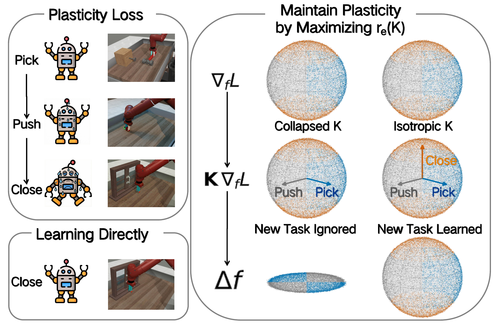

<div align="center">

# SPHERE: Mitigating the Loss of Spectral Plasticity in Mixture-of-Experts for Deep Reinforcement Learning

## 🎉 Accepted at ICML 2026 🎉

**Official implementation of SPHERE**

**Lirui Luo · Guoxi Zhang · Hongming Xu · Cong Fang · Qing Li**

[](https://icml.cc/)
[](https://sphere-rl.github.io/)
[](https://github.com/sphere-rl/sphere)
[](pyproject.toml)
[](pyproject.toml)
[](LICENSE)

</div>

<p align="center">
  <picture>
    <source srcset="assets/teaser.webp" type="image/webp" />
    
  </picture>
</p>

> **TL;DR** SPHERE studies why Mixture-of-Experts (MoE) policies lose plasticity in continual reinforcement learning, diagnoses the drop as a loss of **spectral plasticity** in the empirical NTK, and adds a practical Parseval penalty on routing-weighted expert features to keep update directions diverse.

## Overview

Deep RL agents learn from a stream of experience. In continual learning, their ability to adapt to new experience can diminish over training. Although MoE policies increase capacity and support diverse skills, they can still degenerate in continual RL.

SPHERE formalizes this failure mode as a loss of **spectral plasticity**: policy updates concentrate into too few functional directions as the empirical NTK effective rank drops. The method derives a tractable proxy from expert feature matrices and regularizes the routing-weighted expert feature Gram with a practical Parseval penalty. On MetaWorld and HumanoidBench, SPHERE improves average success under continual RL by 133% and 50% over an unregularized Top-K MoE baseline.

This repository contains the official HumanoidBench training code for the paper: Top-K MoE PPO, the SPHERE regularizer, and scripts for the reported five-task HumanoidBench CRL setting.

## Highlights

- Spectral-plasticity diagnosis for MoE policies in continual deep RL
- Practical Parseval penalty on routing-weighted expert features
- Top-K MoE PPO implementation in JAX / Stable-Baselines-style training code
- HumanoidBench scripts for both the unregularized Top-K MoE baseline and SPHERE
- Public project page: <https://sphere-rl.github.io/>

## Quick Start

```bash
uv venv --python 3.11
source .venv/bin/activate
uv sync --frozen

# Short one-task smoke run. Omit these Hydra overrides for the full 5-seed run.
bash scripts/moe/humanoidbench/run_moe_ppo_topk_sphere_gradscale.sh \
  seed=0 \
  tasks=[h1_stand] \
  total_timesteps=100000 \
  num_envs=16
```

The HumanoidBench dependency is pulled from `https://github.com/liruiluo/humanoid-bench.git` via `pyproject.toml`.

## Installation

### Prerequisites

1. Python `3.11`
2. `uv` for environment management: <https://github.com/astral-sh/uv>
3. NVIDIA GPU with CUDA-compatible drivers for JAX/CUDA training
4. A C/C++ toolchain for native Python packages

### Environment setup

From the repository root:

```bash
uv venv --python 3.11
source .venv/bin/activate
uv sync --frozen
```

Project shell scripts automatically source the local virtual environment via `scripts/common/setup_env.sh`, so run them directly with `bash` instead of wrapping them in `uv run`. The committed `uv.lock` is provided as the release lock used for this code snapshot; if dependency resolution fails on a future platform because of GPU-specific wheels, regenerate the lock for that platform with `uv lock` after confirming the intended JAX/CUDA wheel set.

### Verify JAX GPU setup

```bash
python -c "import jax; print('JAX version:', jax.__version__); print('JAX devices:', jax.devices()); print('JAX backend:', jax.default_backend())"
```

Expected output should show a CUDA device and `gpu` backend.

## Running Experiments

### HumanoidBench Top-K MoE baseline

```bash
bash scripts/moe/humanoidbench/run_moe_ppo_topk.sh
```

### HumanoidBench Top-K MoE + SPHERE

```bash
bash scripts/moe/humanoidbench/run_moe_ppo_topk_sphere_gradscale.sh
```

Both scripts run five seeds (`0,1,2,3,4`) on five HumanoidBench tasks by default:

```text
h1_stand, h1_walk, h1_pole, h1_slide, h1_run
```

Outputs are written under:

```text
outputs/<algo>/<timestamp>/<run_name>/<env_name>/
```

Each run directory contains TensorBoard logs, evaluation arrays, checkpoints, and VecNormalize state when enabled. A public five-seed run-record bundle is attached to <https://github.com/sphere-rl/sphere/releases/tag/repro-hb-crl-sphere-20260504>.

### Override Hydra arguments

All script arguments after the script name are forwarded to Hydra. For example, to run one seed on a shorter smoke test:

```bash
bash scripts/moe/humanoidbench/run_moe_ppo_topk_sphere_gradscale.sh \
  seed=0 \
  tasks=[h1_stand] \
  total_timesteps=100000 \
  num_envs=16
```

## Repository Layout

```text
configs/   Hydra configs for PPO, Top-K MoE PPO, and SPHERE
scripts/   Launch scripts for HumanoidBench experiments
src/       Training, evaluation, MoE PPO, and SPHERE implementation
env/       HumanoidBench environment wrapper
assets/    README figures
```

The SPHERE penalty implementation is in `src/algorithms/moe/sphere.py`, and the PPO integration is in `src/algorithms/moe/moe_ppo.py`.

## Citation

If you find this repository useful, please cite:

```bibtex
@inproceedings{luo2026sphere,
  title     = {SPHERE: Mitigating the Loss of Spectral Plasticity in Mixture-of-Experts for Deep Reinforcement Learning},
  author    = {Luo, Lirui and Zhang, Guoxi and Xu, Hongming and Fang, Cong and Li, Qing},
  booktitle = {Proceedings of the 43rd International Conference on Machine Learning},
  year      = {2026}
}
```
